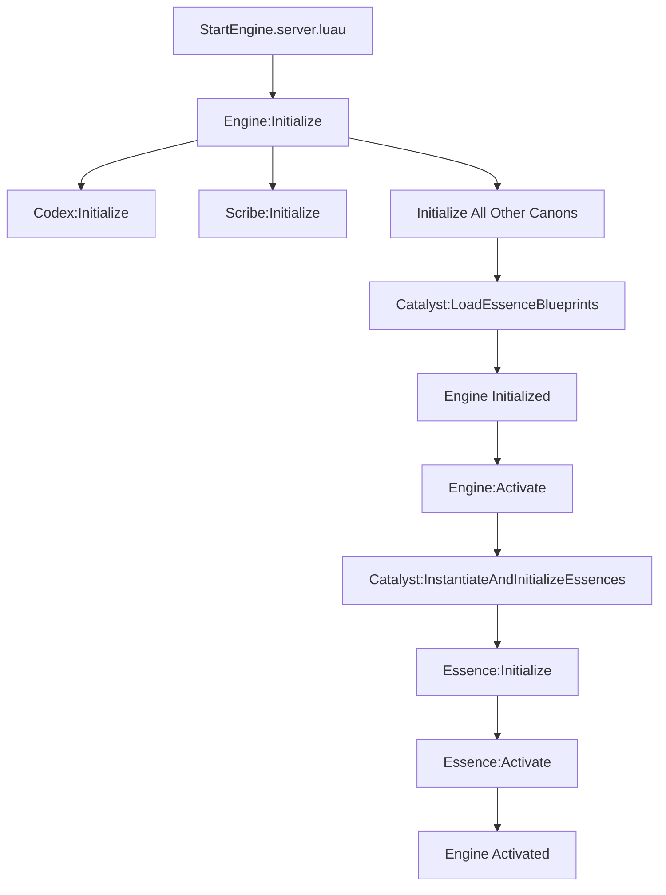

# Prometheus Epsilon Architecture

## 1. Vision & Philosophy

Prometheus Epsilon is not just a collection of tools, but an **orchestration framework for simulated cognitive entities** within the Roblox environment. It is designed for ambitious projects that require a robust, scalable, and highly structured architecture.

The core philosophy is based on **Inversion of Control (IoC)**: the central Engine governs the lifecycle of modular logical units called "Essences," rather than letting these units manage their own state chaotically.

**Key Objectives:**
- **Robustness:** Isolate application logic ("Essences") from each other and from the core to prevent side effects.
- **Scalability:** Allow for the addition of complex features without degrading project performance or maintainability.
- **Extensibility:** Provide a clear and defined way to extend the framework's capabilities.
- **Testability:** The separation of concerns facilitates unit and integration testing.

## 2. Core Concepts

The architecture is built on three pillars:

### a. The Engine (`PrometheusEpsilon_Engine`)
This is the orchestrator. It is the single entry point for the framework. Its responsibilities are:
- Managing the framework's lifecycle (`Initialize`, `Activate`, `Shutdown`).
- Loading and initializing the core modules: the **Canons**.
- Orchestrating the lifecycle of **Essences** via the `Canon_Catalyst`.

### b. The Canons (`Canon_*`)
The Canons are the vital organs of the Engine. They are specialized, singleton services that provide fundamental functionalities to the entire system.
- **`Scribe`**: Logging and traceability.
- **`Codex`**: Configuration management.
- **`EventBus`**: Asynchronous event-based communication (Publish/Subscribe).
- **`Scheduler`**: Task scheduling with priority management.
- **`Registry`**: Service registration and discovery.
- **`Catalyst`**: Essence lifecycle manager.
- **`StateManager`**: Data persistence manager.
- ... and others for knowledge, security, etc.

### c. The Essences (`EpsilonEssence_Pragmatic`)
An Essence is a unit of application logic. This is where the developer using the framework will write their game code. Each Essence:
- Is a `ModuleScript` that follows a specific "contract" (implements `OnInitialize`, `OnActivate`, `OnShutdown`).
- Runs in a "sandboxed" environment, with controlled access to the Engine's Canons through a dedicated interface.
- Can be enabled, disabled, and configured via "Blueprints."

## 3. How to Use

This repository is structured to separate the core framework from a practical example.

*   **`/framework`**: Contains the core Prometheus Epsilon engine. This is the folder you will copy into your own Roblox project, typically within `ReplicatedStorage`.
*   **`/example`**: Contains a complete, working example project that demonstrates how to use the framework. You can use this as a reference or a starting point for your own game. It includes an example `default.project.json` for Rojo users.

## 4. Framework Structure

The framework itself is organized to be placed within `ReplicatedStorage`.

```
ReplicatedStorage
└── PrometheusEpsilon
    ├── Engine.luau          # The core Engine and main orchestrator
    ├── EpsilonEssence.luau  # The base class for all Essences
    |
    ├── Lib
    |   ├── Promise.luau     # Promise implementation
    |   └── Utility.luau     # Utility functions
    |
    └── Canons
        ├── Scribe.luau
        ├── Codex.luau
        ├── EventBus.luau
        ├── Scheduler.luau
        ├── Registry.luau
        ├── Catalyst.luau
        └── StateManager.luau
```

## 5. Startup Workflow

1.  A server script (e.g., in `ServerScriptService`) `require`s the `Engine.luau`.
2.  It calls `Engine:Initialize(config, blueprints, essenceRoot)`.
    - The Engine initializes all its Canons in a specific order.
    - The `Catalyst` loads the Essence "blueprints."
3.  It calls `Engine:Activate()`.
    - The `Catalyst` instantiates and initializes all Essences marked as "enabled."
    - If `AutoActivate` is enabled, the `Catalyst` calls `OnActivate()` on each initialized Essence.
4.  The system is online. Essences communicate with each other and with game systems via the `EventBus` and `Registry`.

### A. Engine Startup


### B. Player Session Management (Data Persistence)
This flow demonstrates how the framework handles player data persistence automatically.

```mermaid
graph TD
    subgraph Player Joins
        A[Players.PlayerAdded Event] --> B[PlayerSessionManager];
        B --> C{StateManager:Load(userId)};
        C -->|Data found| D[Merge with Defaults];
        C -->|No data (new player)| E[Create Default Data];
        D --> F[Catalyst:InstantiateEssence];
        E --> F;
        F --> G[New PlayerEssence created];
    end
    
    subgraph Player Leaves
        H[Players.PlayerRemoving Event] --> I[PlayerSessionManager];
        I --> J[Get PlayerEssence];
        J --> K[essence:GetState()];
        K --> L{StateManager:Save(userId, state)};
        L --> M[essence:Shutdown()];
    end
```

## 6. Project Status & V1 Roadmap

This section provides a high-level overview of the current status of the Prometheus Epsilon framework and the roadmap for its official V1 release.

---

### ✅ Core Engine & Canons Status

The foundational layer of the framework is stable and functional.

- ✅ `Scribe` (Logging): Fully functional.
- ✅ `Codex` (Configuration): Fully functional.
- ✅ `EventBus` (Messaging): Fully functional.
- ✅ `Scheduler` (Tasking): Fully functional.
- ✅ `Registry` (Service Discovery): Fully functional.
- ✅ `Catalyst` (Lifecycle Management): **Enhanced!** Now supports dynamic instantiation of Essences at runtime.
- ✅ `StateManager` (Data Persistence): **Enhanced!** Now fully integrated with Roblox's `DataStoreService`.
- 🟡 `KnowledgeGraph` (Relational Data): Stubbed. Awaiting implementation.
- 🟡 `PolicyEnforcer` (Security): Stubbed. Awaiting implementation.
- 🟡 `Telemetry` (Metrics): Stubbed. Awaiting implementation.
- 🟡 `SelfReflectionSimulator` (Meta): Stubbed. Awaiting implementation.

---

### ✅ Core Features Status

These are the key functionalities provided by the framework.

- ✅ **Engine Core**: Stable initialization, activation, and shutdown sequences.
- ✅ **Asynchronous Promise Library**: Robust and used throughout the framework.
- ✅ **Essence Lifecycle**: `OnInitialize`, `OnActivate`, `OnShutdown` are fully orchestrated.
- ✅ **Dynamic Essence Instantiation**: Essences can be created on demand.
- ✅ **Player Session Management**: The framework now automatically handles player join/leave events.
- ✅ **Data Persistence**: Player data is automatically loaded and saved between sessions.

---

### 🎯 V1 Roadmap (Next Steps)

With the core functional, our focus now shifts to making the framework ready for production games.

1.  🎯 **Client-Server Communication Gateway**: The highest priority. We need a secure and structured way for clients to send requests to server-side Essences (e.g., via a dedicated `RemoteBridge` Essence). This will unlock the framework's full potential.

2.  🎯 **`PolicyEnforcer` Implementation**: A crucial security feature. This Canon will allow developers to define rules about which Essences can call which functions or publish which events, preventing exploits.

3.  🎯 **Error Handling & Resilience**: Improve how the engine handles a failure in one Essence without compromising the stability of the entire server. This includes more granular error reporting.

4.  🎯 **Documentation & Examples**: Create more in-depth tutorials and examples for common use-cases beyond player data. 